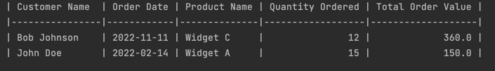

# Design a complex SQL query for a MySQL database and explain the results

[](https://github.com/nogibjj/python-template/actions/workflows/cicd.yml)


## Goal

> Duke University IDS 706 Weekly Mini Project 6


Requirements
- Design a complex SQL query involving joins, aggregation, and sorting
- Provide an explanation for what the query is doing and the expected results

Deliverables
-  SQL query
-  Written explanation of the query


## Preparation

1. make sure a data file is in the same directory as main.py
```
project/
│
├── data/
│   ├── customers.csv
│   ├── orders.csv
│   ├── order_details.csv
│   └── products.csv
│
└── main.py
│
└── test_main.py
└── .env
```
> NOTE: the .env file is aimed to hide the MySQL password and added to the .gitignore file.

2. `Python3` or above
3. `pandas` to manipulate data
4. install the [MySQL](https://dev.mysql.com/downloads/installer/] 8.0.0) or above
   - make sure the MySQL server is running
5. `sqlalchemy` to convert csv to MySQL database
6. `decouple` to hide the MySQL password

## Complex SQL Query

    ```sql
    SELECT 
        c.customer_name, 
        o.order_date, 
        p.product_name, 
        SUM(od.quantity) AS total_ordered_quantity, 
        SUM(od.quantity * p.price) AS total_order_value
    FROM 
        customers c
    JOIN 
        orders o ON c.customer_id = o.customer_id
    JOIN 
        order_details od ON o.order_id = od.order_id
    JOIN 
        products p ON od.product_id = p.product_id
    WHERE 
        o.order_date BETWEEN '2022-01-01' AND '2022-12-31'
    GROUP BY 
        c.customer_name, 
        o.order_date, 
        p.product_name
    HAVING 
        SUM(od.quantity) > 10
    ORDER BY 
        total_order_value DESC, 
        c.customer_name ASC;
    ```

## Explanation

The above SQL query is designed to retrieve order details for customers who have ordered more than 10 of any product within the year 2022. The details provided include the customer name, order date, product name, total quantity of that product ordered, and the total value of that order.

How the Query Works:

1. Joins: Four tables are involved in this query:

- customers - contains details about customers
- orders - contains order information
- order_details - contains information about individual product orders and their quantities
- products - contains details about products including their prices

The joins ensure that all relevant data from these tables can be accessed in one query. They're connected by their respective primary and foreign keys.

2. Aggregation:

- SUM(od.quantity) calculates the total quantity of a particular product ordered by a customer on a given date.

- SUM(od.quantity * p.price) calculates the total order value for that product by multiplying the quantity ordered with the product price.

3. Filtering: 

The WHERE clause ensures that only orders made in the year 2022 are considered. The HAVING clause ensures we only see rows where the total quantity ordered of a product exceeds 10.

4. Sorting:

- Orders are primarily sorted in descending order based on the total value (total_order_value), which means orders with the highest value will appear first.

- If two orders have the same total value, they are then sorted in ascending order based on the customer's name (c.customer_name).

## Run and Result

### Format Output



The result will be a list of orders from 2022 where any product was ordered in a quantity greater than 10. Each row will display:

- The name of the customer who placed the order.
- The date of the order.
- The name of the product that was ordered.
- The total quantity of that product that was ordered.
- The total value of that product order.

The results will be sorted with the highest order value at the top. If multiple orders have the same value, they will be sorted alphabetically by the customer's name.

## Reference

1. https://github.com/nogibjj/python-template
2. https://dev.mysql.com/downloads/installer/
3. https://www.runoob.com/python3/python-mysql-connector.html
4. https://www.runoob.com/note/45833
5. https://stackoverflow.com/questions/62580240/django-cannot-import-name-config-from-decouple
